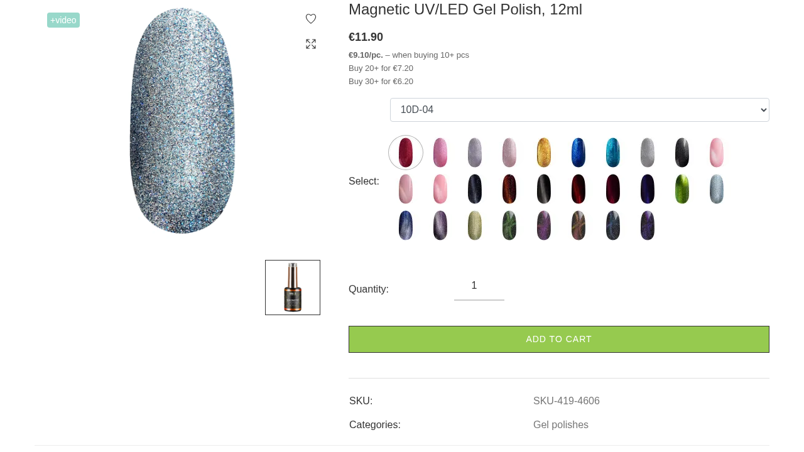
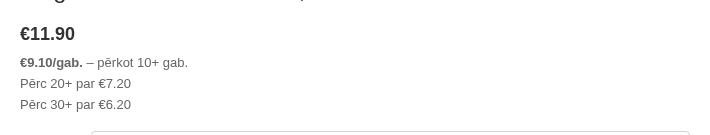
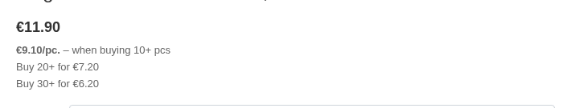
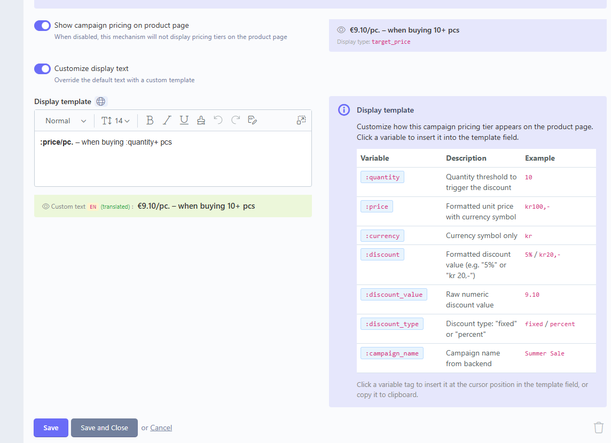

# Campaign Pricing for Shopaholic

Display campaign-driven quantity pricing tiers on product pages for the [Lovata Shopaholic](https://shopaholic.one/) ecosystem.

Displays dynamic, cached, currency-aware quantity pricing tiers sourced from the Campaign/PromoMechanism system.



## Features

- **Quantity pricing tiers** on product pages — customers see accurate, campaign-driven pricing before adding to cart
- **9 built-in mechanism resolvers** — OfferQuantityGreater, OfferTotalQuantityGreater, PositionCountGreater, WithoutCondition, SpecificPriceByQuantity (and their MinPrice variants)
- **Multi-currency support** — automatic conversion for EUR, NOK, and other currencies via Shopaholic's CurrencyHelper
- **Translatable display templates** — admin-customizable text per mechanism with `:placeholder` variables, translated per locale via RainLab.Translate
- **Extensible** — third-party plugins register custom mechanism resolvers via event
- **Cached** — CCache-backed store with surgical per-offer invalidation on Campaign/PromoMechanism changes
- **Ready-to-use component** — drop `` on any product page

## Screenshots

### Frontend — pricing tiers on product page

| Latvian | English | Russian |
|---------|---------|---------|
|  |  |  |

### Backend — promo mechanism display settings



## Requirements

| Dependency | Version |
|-----------|---------|
| PHP | ^8.3 |
| October CMS | ^4.0 |
| Lovata.Shopaholic | ^1.32 |
| Lovata.CampaignsShopaholic | ^1.3 |
| Lovata.Toolbox | ^2.2 |

**Soft dependencies** (used if available):
- **Lovata.OrdersShopaholic** — PromoMechanism model
- **RainLab.Translate** — translatable display templates

## Installation

```bash
composer require logingrupa/oc-campaignpricing-plugin
php artisan october:migrate
```

## Usage

### Quick start (no code)

1. Add the **CampaignPricing** component to your product page in the CMS backend
2. Place the component tag where you want tiers displayed:

```twig

```

The component renders pricing tiers for the product's default offer automatically.

### Theme integration (custom markup)

Access tier data via the `campaign_pricing_list` accessor on any `OfferItem`:

```twig



<div class="pricing-tiers">
    
    <div class="tier">
        {{ obTier.display_text|raw }}
    </div>
    
</div>

```

### AJAX offer switching

Update tiers when the user selects a different offer:

```js
jax.ajax('CampaignPricing::onSwitchOffer', {
    data: { product_id: 123, offer_id: 456 },
    update: { 'CampaignPricing::default': '#campaignPricingTiers' }
});
```

### Available tier properties

| Property | Type | Description |
|----------|------|-------------|
| `quantity` | int | Quantity threshold |
| `price_value` | float | Final unit price in active currency |
| `price` | string | Formatted price string |
| `discount_display` | string | Formatted discount ("5%" or "€20") |
| `discount_value` | float | Raw numeric discount value |
| `discount_type` | string | `"fixed"` or `"percent"` |
| `display_type` | string | Resolver display type |
| `display_text` | string | Localized human-readable tier text |
| `mechanism_name` | string | Mechanism class basename |

## Custom display templates

Admins can customize tier text per promo mechanism in the backend. Navigate to any PromoMechanism → **Campaign Pricing Display** tab.

### Available placeholders

| Placeholder | Description | Example |
|-------------|-------------|---------|
| `:quantity` | Quantity threshold | `10` |
| `:price` | Formatted price with currency | `€9.10` |
| `:currency` | Currency symbol | `€` |
| `:discount` | Formatted discount | `15%` or `€20` |
| `:discount_value` | Raw discount number | `15` |
| `:discount_type` | Type | `fixed` or `percent` |
| `:campaign_name` | Campaign name | `Summer Sale` |

### Example template

```html
<strong>:price/pc.</strong> — when buying :quantity+ pcs
```

Renders as: **€9.10/pc.** — when buying 10+ pcs

## Extending with custom resolvers

Third-party plugins can register custom mechanism resolvers:

```php
Event::listen('campaignpricing.tier.register_resolvers', function () {
    return [
        MyCustomMechanism::class => [
            'quantity_property' => 'my_qty_field',
            'price_type'       => 'target_price', // or 'discount'
            'display_type'     => 'custom',
        ],
    ];
});
```

**Price types:**
- `discount` — discount_value is subtracted from base price (fixed) or percentage
- `target_price` — discount_value IS the final unit price

## Architecture

```
OfferItem.campaign_pricing_list (accessor)
    → OfferCampaignPricingStore (cached, per offer ID)
        → 4 pivot table fan-out (offer, product, brand, category)
        → Campaign::active()->currentActive() filter
        → TierResolverRegistry (mechanism → tier config)
    → OfferItemExtendHandler (inject context, dedup by qty)
    → CampaignPricingCollection
        → CampaignPricingItem (price computation, display text)
```

### Cache invalidation

| Event | Handler | What gets cleared |
|-------|---------|-------------------|
| Campaign save/delete | CampaignPricingModelHandler | All offers linked via 4 pivot tables |
| Campaign relation attach/detach | CampaignPricingRelationHandler | All offers linked to the campaign |
| PromoMechanism save | PromoMechanismPricingHandler | All offers via campaigns using that mechanism |

## Development

```bash
# Run full QA pipeline
composer qa

# Individual tools
composer test          # Pest (50 tests)
composer analyse       # PHPStan level 10
composer phpmd         # PHPMD
composer pint          # Pint PSR-12 fix
composer pint-test     # Pint dry-run
composer rector-dry    # Rector dry-run
composer rector        # Rector apply

# Or via Makefile
make all               # pint-test + analyse + phpmd + test
```

## License

MIT
